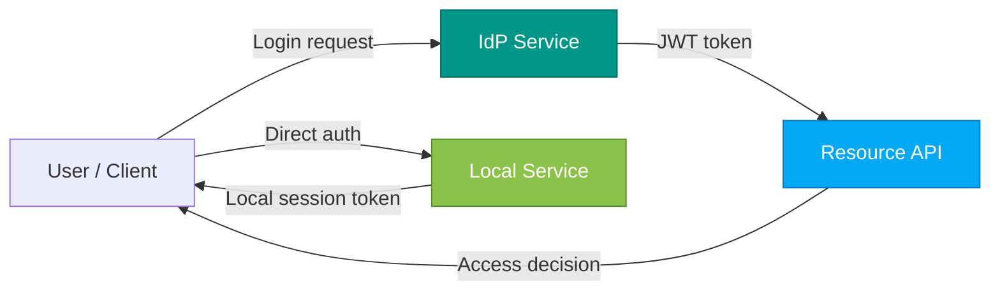

# 🔐 SDA4 — Zero Trust Authentication & Context Verification (FastAPI + Docker)

> Centralised IdP tokens vs. decentralised local auth, with context-aware access decisions.

* **Python** 3.11 · **FastAPI** · **Docker Compose**
* Three services:

  * **IdP** – issues JWTs with extra claims (`sub, role, deviceid, riskscore, iat, exp, typ="access", auth_time`)
  * **Resource API** – verifies IdP tokens and enforces context policy (business hours, device allow-list, sensitive paths)
  * **Local Service** – independent cookie-based auth (short-lived local JWT, default **60s** TTL)

---

## 🧭 What’s implemented

### Centralised (IdP → Resource API)

* **IdP (`/idp`)** issues signed JWTs including the required claims.
* **Resource API (`/resource_api`)** strictly parses `Authorization: Bearer …`, validates signature/expiry, then applies **context policy**:

  * **Business hours** (Europe/Zurich), deny outside window
  * **Device allow-list**, deny unknown or missing device
  * **Sensitive paths** (`/export`, `/admin/*`):

    * `role=admin` → allow
    * non-admin with high risk → deny
    * otherwise → `mfa_required` (step-up placeholder)

### Decentralised (Local Service)

* **Local Service (`/local_service`)** performs its **own** username/password auth.
* Issues a **local** signed JWT (`typ="local"`, `iss="local_service"`) stored in an **HttpOnly cookie** `session`.
* Default **TTL = 60 seconds** (env-driven) to demonstrate short-lived edge sessions.
* Protected endpoints read & verify the cookie; `/local-admin` additionally enforces `role=admin`.

---




## 🗂️ Repository layout

```
SDA4/
├─ docker-compose.yml
├─ Makefile
├─ idp/
│  ├─ app.py         # issues JWTs with extended claims
│  ├─ .env           # JWT_SECRET, JWT_ALG, TOKEN_EXP_MINUTES
│  └─ Dockerfile
├─ resource_api/
│  ├─ app.py         # routes + decision mapping (allow/challenge/deny)
│  ├─ auth.py        # strict Bearer parsing + token verification
│  ├─ context.py     # business hours / device allow-list / sensitive paths policy
│  ├─ .env           # policy config: hours, devices, sensitive paths, TZ
│  └─ Dockerfile
└─ local_service/
   ├─ app.py         # independent cookie session; role checks; 60s TTL demo
   ├─ .env           # LOCAL_JWT_SECRET/ALG, LOCAL_TOKEN_TTL_SECONDS
   └─ Dockerfile
```

---

## 🚀 Run it

```bash
# build and start containers, wait for health
make up
# or: docker compose up --build
```

Health endpoints:

* IdP → `http://localhost:8001/health`
* Resource API → `http://localhost:8002/health`
* Local Service → `http://localhost:8003/health`

---

## 🎬 Demos (Makefile)

> These targets exercise both architectures and show allow / challenge / deny with reasons.

* **All centralised scenarios (IdP → Resource API):**

  ```bash
  make demo-centralised
  ```

  * `/resource` with trusted device → **allow**
  * `/export` as non-admin → **mfa_required**
  * `/export` as admin → **allow**
  * Rogue/missing device → **403 deny** with human-readable reason

* **All decentralised (Local Service cookie):**

  ```bash
  make demo-local
  ```

  * Login as `localuser` → `/local-resource` OK
  * Same user on `/local-admin` → **403**
  * `localadmin` on `/local-admin` → **200**

* **Narrated demo (with JWT inspection):**

  ```bash
  make demo-narrated
  ```

  Shows decoded IdP JWT payloads (claims like `deviceid`, `riskscore`, `exp`, etc.), then runs the calls.

* **Expiry proof (60-sec cookie):**

  ```bash
  make demo-local-expiry
  ```

  Logs in locally, calls OK immediately, **waits ~60s**, then calls again → **401** (expired cookie token).

> Tip: `make print-config` prints effective env settings inside containers (helpful for debugging).

---

## 🔧 Configuration (env)

### IdP (`idp/.env`)

* `JWT_SECRET=dev-secret-idp`
* `JWT_ALG=HS256`
* `TOKEN_EXP_MINUTES=30`  ← token lifetime for IdP access tokens

### Resource API (`resource_api/.env`)

* `JWT_SECRET=dev-secret-idp` (same as IdP for HMAC demo)
* `JWT_ALG=HS256`
* `BUSINESS_HOURS_START=7`
* `BUSINESS_HOURS_END=19`
* `REGISTERED_DEVICE_IDS=mac-001,win-007,phone-123`
* `SENSITIVE_PATHS=/export,/admin`
* `TZ=Europe/Zurich`

### Local Service (`local_service/.env`)

* `LOCAL_JWT_SECRET=local-secret`
* `LOCAL_JWT_ALG=HS256`
* `LOCAL_TOKEN_TTL_SECONDS=60`  ← **short-lived local session (demo)**

---

## 🔎 API quick reference

| Service       | Endpoint              | Auth                              | Behavior                                                                                  |
| ------------- | --------------------- | --------------------------------- | ----------------------------------------------------------------------------------------- |
| IdP           | `POST /login`         | —                                 | Returns JSON with `access_token` (JWT) + `expires_in`                                     |
| Resource API  | `GET /resource`       | `Authorization: Bearer <IdP JWT>` | Non-sensitive; runs context checks; usually **allow** in business hours on trusted device |
| Resource API  | `GET /export`         | Bearer                            | **Sensitive**; admin **allow**, non-admin **mfa_required** or **deny** (risk/device)      |
| Resource API  | `GET /admin/metrics`  | Bearer                            | Same as `/export` (sensitive)                                                             |
| Local Service | `POST /local-login`   | —                                 | Sets **HttpOnly** cookie `session` with local JWT (`typ:"local"`)                         |
| Local Service | `GET /local-resource` | Cookie                            | Valid cookie → **200**                                                                    |
| Local Service | `GET /local-admin`    | Cookie                            | Requires `role=admin` or **403**                                                          |

---

## 🧠 Rationale (Zero Trust)

* **Never trust, always verify:** every request is re-checked; the Resource API doesn’t trust the network or prior state.
* **Context matters:** time window, device identity, and sensitivity of the target path drive the decision (**allow / challenge / deny**).
* **Separation of concerns:** IdP focuses on identity + claims; Resource API focuses on **policy**; Local Service shows independence and **short TTL** sessions for edge-style trust.

---

## 🧪 Smoke tests

```bash
make up
make demo-centralised
make demo-local
make demo-local-expiry
```

---

## 📄 License

MIT — educational use for the SDA4 course.
